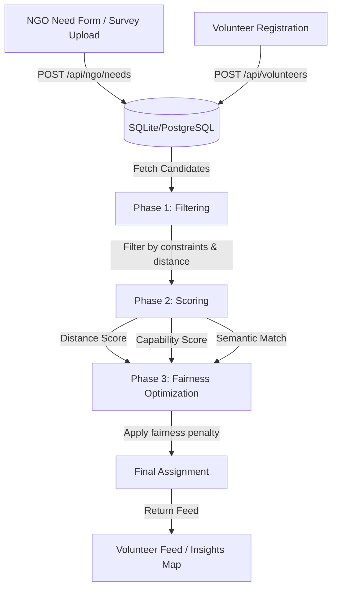

# FairAid Architecture

This document describes the core architecture and data flow of the FairAid platform.

## Allocation Pipeline

FairAid uses a 3-phase pipeline to match volunteers to needs efficiently and fairly.

### 1. Filtering (Phase 1)
The system performs a rapid first-pass filter over the volunteer pool, strictly removing candidates who are outside the emergency radius or lack hard-required skills. This reduces the search space significantly.

### 2. Scoring (Phase 2)
The remaining candidates are scored using a dynamic weighting system that adjusts based on urgency:
- **Distance Score**: Closer volunteers score higher.
- **Capability Score**: Overlap between the volunteer's skills/specialties and the need's requirements.
- **Semantic Match**: Cosine similarity between the embeddings of the volunteer's profile and the need's description.

### 3. Fairness Optimization (Phase 3)
A fairness penalty is applied to ensure equitable distribution of resources. The optimizer prevents the system from overwhelmingly assigning volunteers to a single high-priority task while starving others, balancing overall system utility with fairness across all open needs.

## Data Flow
1. **Input**: Data enters the system via NGO operators filling out forms, or via field surveyors uploading CSV files. The CSV processor automatically parses lat/lng and generates need records.
2. **Storage**: Stored in a relational database (`users`, `volunteers`, `needs`, `sessions`). Passwords are secured using `bcrypt`.
3. **Dispatch**: The backend periodically runs the allocator or evaluates scores on-demand when a volunteer requests their feed.
4. **Action**: Volunteers see tasks sorted by `recommendation_score` and `capability_score`, and their decisions ("accepted", "pinned", "interested") are recorded back into the system.
